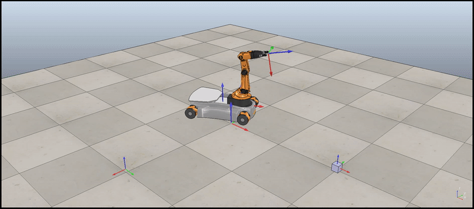

## Modern Robotics - YouBot - Mobile Manipulation Capstone Project

This repo describes the mobile manipulation caption project from the book - Modern Robotics. The objective of this project is to build a software that plans a trajectory for the end-effector of the youBot mobile manipulator (a mobile base with four mecanum wheels and a 5R robot arm), performs odometry as the chassis moves, and performs feedback control to drive the youBot to pick up a block at a specified location, carry it to a desired location, and put it down.

There are four main cases for which the functions are modified:
1. Best Case : The case in which best correction is observed.
2. Feedforward Control: The case in which only the feedforward control is applied.
3. Overshoot Case: The case when the robot overshoots while correcting the trajectory.
4. New Case: The case when new task is executed by the robot.

Each folder contains TrajectoryGenerator, NextState, FeedbackControl functions and the WrapperScript for each of the designated task.
In order to run any case, run the WrapperScript of that particular case.
To test the functions, they can directly be executed as they contain the testing code. 
Respective csv file will be generated to simulate it in CoppeliaSim.

The results of the four cases are:
1. Best Case

2. Feedforward Control

3. Overshoot case

4. New Case

